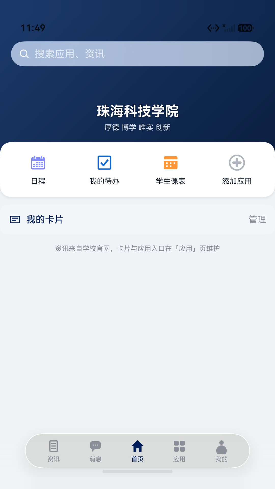
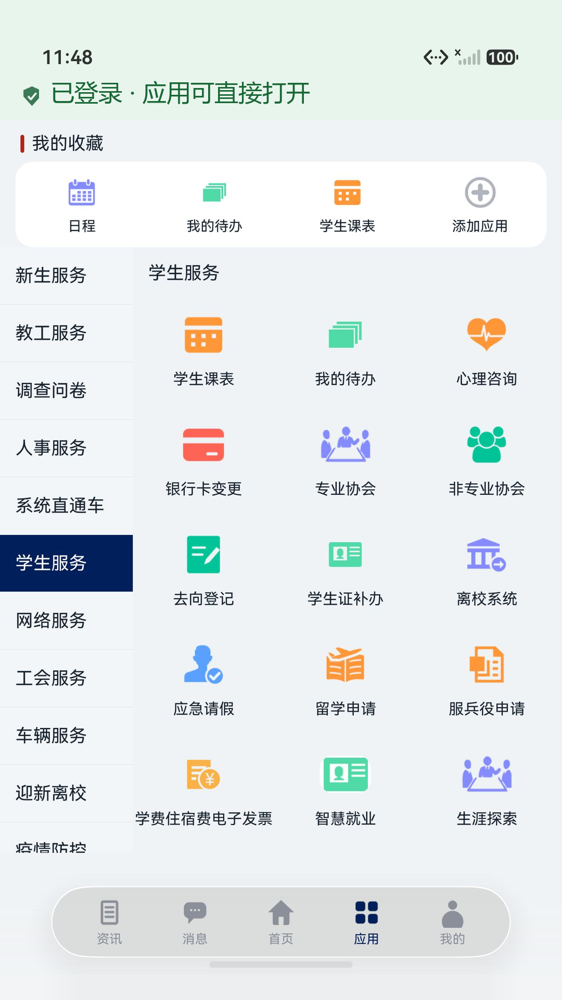
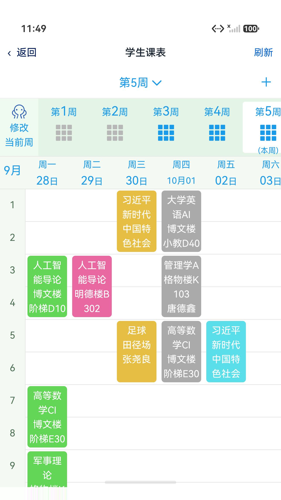
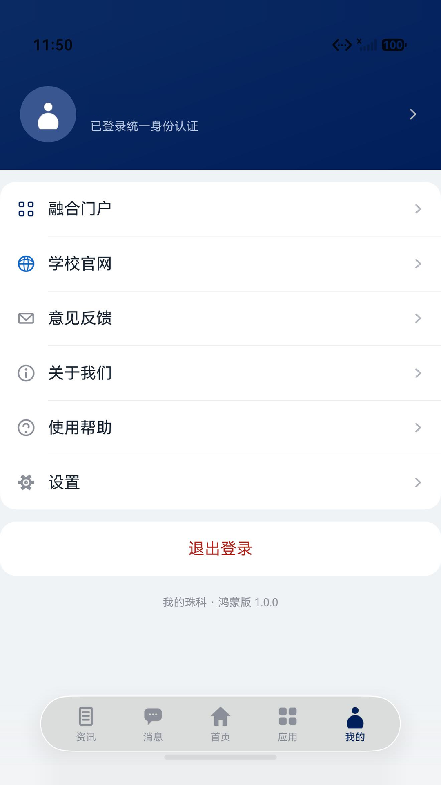
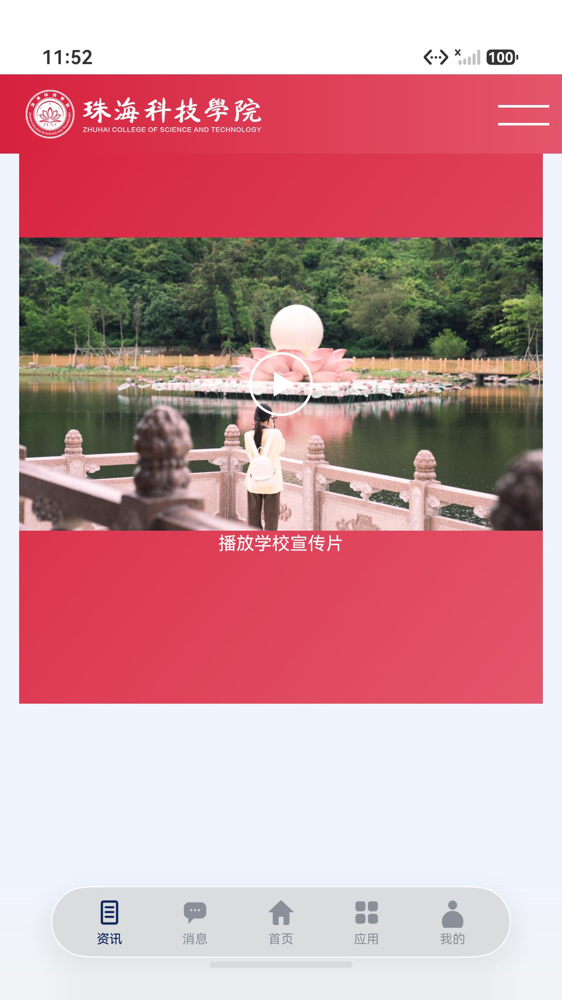
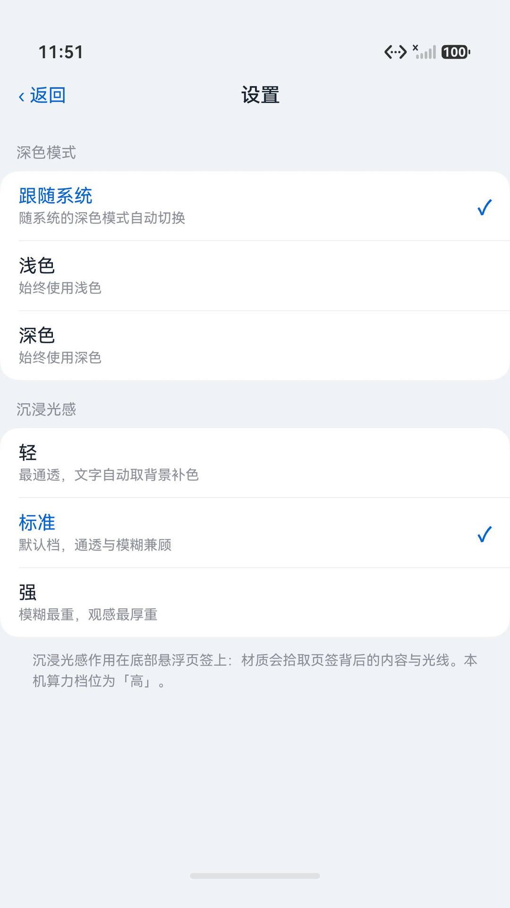
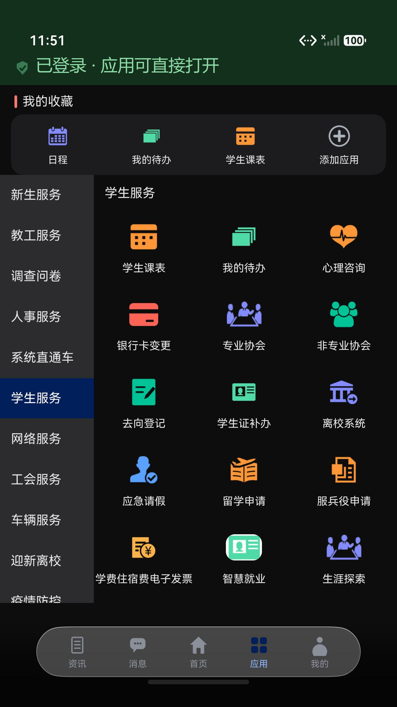
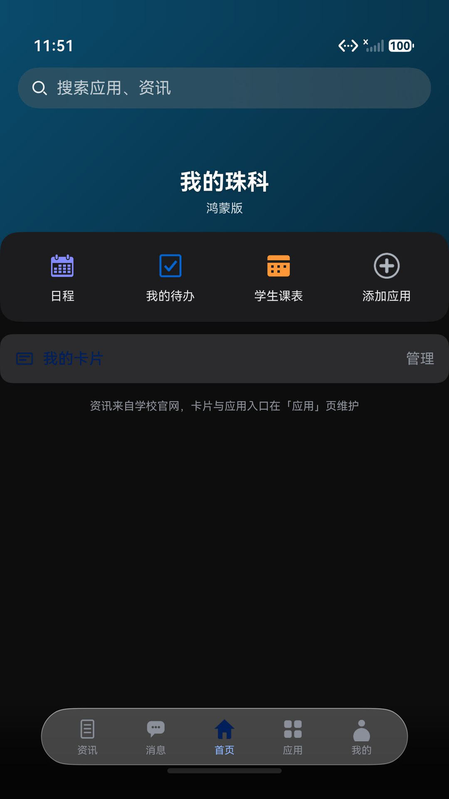
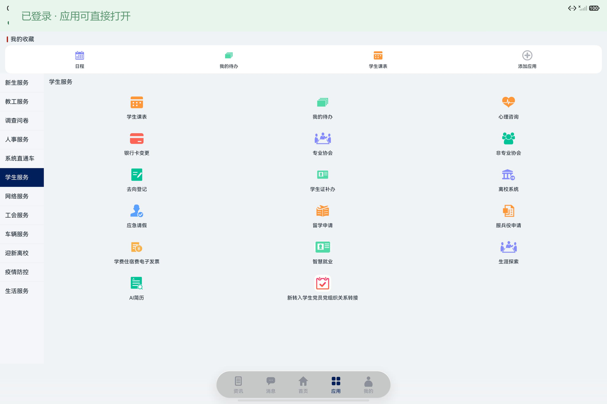

# 我的珠科 · 鸿蒙版

> 珠海科技学院校园门户的 **HarmonyOS 原生客户端**，用 ArkTS + ArkUI 从零重写。

[](https://developer.huawei.com/consumer/cn/)
[](https://developer.huawei.com/consumer/cn/arkts)
[](LICENSE)

用上了系统级的 **沉浸光感**（Immersive Material）悬浮页签、**桌面小组件**、深色 / 浅色 / 跟随系统三态主题，
以及校内统一身份认证（CAS）免密直通。

> ⚠️ **本项目是第三方非官方客户端**，由学生个人开发，**不由珠海科技学院发布，也不代表学校立场**。
> 应用内的资讯、通知、应用入口、课表等内容均来自学校公开的官方网站与信息门户。

---

## 目录

- [截图](#截图)
- [功能](#功能)
- [亮点一：沉浸光感](#亮点一沉浸光感)
- [亮点二：桌面小组件](#亮点二桌面小组件)
- [环境要求](#环境要求)
- [快速开始](#快速开始)
- [装到真机](#装到真机)
- [工程结构](#工程结构)
- [数据是从哪来的](#数据是从哪来的)
- [已知限制](#已知限制欢迎-pr)
- [常见问题](#常见问题)
- [免责声明](#免责声明)
- [许可](#许可)

## 截图

| 首页 | 应用中心 | 学生课表 | 个人中心 |
| :--: | :--: | :--: | :--: |
|  |  |  |  |

| 校园资讯 | 设置（含沉浸光感三档） | 应用（深色） | 首页（深色） |
| :--: | :--: | :--: | :--: |
|  |  |  |  |

平板（MatePad Pro 13，横屏）：



## 功能

| 模块 | 说明 |
| --- | --- |
| **首页** | 轮播、悬浮搜索框、「我的收藏」快捷入口（与「应用」页联动）、卡片入口 |
| **应用** | 从学校门户接口拉取真实的应用分类与全部应用（27 个），左侧分类栏 + 右侧宫格；可收藏（最多 4 个）、长按移除；图标直接用服务端原图 |
| **应用详情** | 点击进入轻应用，统一身份认证（CAS）由系统 Web 组件自动完成，无需二次输入密码 |
| **资讯** | 学校官网的移动端页面 |
| **消息** | 学校通知公告、融合门户待办入口 |
| **我的** | 登录状态、融合门户、学校官网、意见反馈、关于、帮助、设置 |
| **设置** | 深色 / 浅色 / 跟随系统；沉浸光感 轻 / 标准 / 强 |
| **桌面小组件** | 今日课表、我的待办（2×2 / 2×4 / 4×4） |

## 亮点一：沉浸光感

HarmonyOS 26 引入的 `uiMaterial.ImmersiveMaterial` 能让控件以"材质"而非"半透明色块"的方式
浮在内容之上 —— 背景会实时折射、随滚动流动。本项目把它用在了底部悬浮页签上。

三档强度在 `common/MaterialGate.ets` 里集中映射，用户可在「设置」里切换：

| 档位 | `ImmersiveStyle` | `materialColor` | `colorInvert` |
| --- | --- | --- | --- |
| 轻 | `ULTRA_THIN` | `#1AFFFFFF` | `true` |
| 标准 | `REGULAR` | `#33FFFFFF` | — |
| 强 | `ULTRA_THICK` | `#59FFFFFF` | — |

`materialColor` **必须带 alpha 通道**，否则不生效；`colorInvert` 只在 `THIN` / `ULTRA_THIN` 两档才有反应。

### 踩过的坑（这部分花的时间最多）

1. **`module.json5` 必须先开开关**：`metadata` 里加 `"ohos.arkui.UIMaterial.state": "enable"`，
   否则 `ImmersiveMaterial` 静默失效，不报错。
2. **只有"专用属性"才真的生效**。`CommonMethod.systemMaterial()` 谁都调得到、也能编译通过，
   但在页签栏上**什么都不会发生**。真正管用的是 `FloatingTabBarStyle.systemMaterial`
   （以及 `Navigation.title` 这类本身就带材质语义的属性）。
3. **同一层不能叠自己的背景**。给 `Tabs` 设了 `barBackgroundColor` / `barBackgroundBlurStyle`
   就必须让位，否则材质被自己的底盖住。
4. **材质色要跟着主题走**。一开始把 `materialColor` 写死成半透明白，
   浅色模式下页面本身接近白色 → 玻璃几乎看不见。改成资源化的
   `bar_frost_light` / `bar_frost_dark`（浅色下是极淡的黑，深色下是极淡的白）之后才正常。

### 怎么验证它真的生效了

光靠肉眼看容易自我催眠，我们用像素级 A/B 比过：在同一个静态页面（我的）上分别截三档的图，
**页面内容像素完全一致**（`top mean = 0.000`），差异全部落在悬浮页签的包围盒
`x=[120,1199] y=[2016,2191]` 内；该条带内的平均绝对差为 **9.57**（轻 vs 标准）、
**19.42**（标准 vs 强）、**28.85**（轻 vs 强），单调递增 —— 说明确实在渲染材质，而不是没反应。

主题切换走 `ability.setColorMode(ConfigurationConstant.ColorMode)`，注意两点：

- 必须在 `windowStage.loadContent` 的**回调里**调用，`onCreate` 阶段调会静默失败；
- 优先级是 **UIAbility > ApplicationContext > 系统设置**，所以 App 一旦自己设过就再也跟随不了系统，
  想恢复跟随要把模式设回 `COLOR_MODE_NOT_SET`。

## 亮点二：桌面小组件

两张卡片：**今日课表**、**我的待办**，支持 2×2 / 2×4 / 4×4 三种尺寸，
配置在 `entry/src/main/resources/base/profile/form_config.json`，
数据经 `EntryFormAbility` 从 preferences（`common/CardStore.ets`）读取。

写卡片时有三条硬约束，踩过就知道：

- **卡片进程里没有网络**，也不能用 `setTimeout`，所有数据必须由 `FormExtensionAbility` 预先算好塞进 `formBindingData`；
- **只有 `@form` 标记过的 API 能用**，`ImmersiveMaterial` 不在其中 —— 所以小组件用不了沉浸光感；
- **卡片不能依赖 HSP**，逻辑要么内联要么放 HAR。

## 环境要求

| 项目 | 版本 |
| --- | --- |
| HarmonyOS SDK | **API 26**（`compatibleSdkVersion` / `targetSdkVersion` = `26.0.0`，本机装的 SDK 是 `26.0.0.105`） |
| DevEco Studio | **26.0.0.851**（构建号 `261.23567.138.36.2600851`） |
| hvigor / modelVersion | `6.26.8` |
| JDK | 21（DevEco 自带 jbr） |

> **为什么必须是 API 26**：沉浸光感用到的 `uiMaterial.ImmersiveMaterial`、
> `FloatingTabBarStyle.systemMaterial`、`barFloatingStyle` 全部是 `@since 26.0.0`，
> 低版本 SDK 里根本没有这些声明，无法向下兼容。想跑在低版本上，只能先把这一层删掉。

## 快速开始

```bash
git clone https://github.com/<你的用户名>/myzcst-harmony.git
```

然后用 DevEco Studio **打开工程根目录**（不是 `entry/`），等 Sync 完成后点 Run。

命令行构建：

```bash
hvigorw --no-daemon assembleHap -p product=default
```

产物在 `entry/build/default/outputs/default/`。发布包（`assembleApp` 生成 `.app` 用于上架）：

```bash
hvigorw --no-daemon assembleApp -p product=default -p buildMode=release
```

### 签名

仓库里的 `build-profile.json5` **故意把 `signingConfigs` 留空**，因为签名口令不能进 Git。

本地怎么跑起来：

1. DevEco Studio → `File` → `Project Structure` → `Signing Configs`
2. 勾上 **Automatically generate signature**，登录华为开发者账号
3. DevEco 会自动申请调试证书、把你的设备 UDID 注册进 Profile，并回填 `build-profile.json5`

要出正式包，就把 `signingConfigs` 换成你自己的发布证书（`.p12` / `.cer` / `.p7b`），
并让 `products[].signingConfig` 指向那个配置名。

> `.gitignore` 已经把 `*.p12`、`*.cer`、`*.p7b`、`build-profile.local.json5` 全部排除，
> 提交前请 `git status` 再确认一次。

## 装到真机

HarmonyOS **没有侧载入口** —— 在文件管理器里点 `.hap` 不会有任何反应。
官方安装方式就是 `hdc`（DevEco 的 Run 按钮底层也是它）：

```bash
# 1. 手机打开「开发者选项 → USB 调试」，插线，确认设备已识别
hdc list targets

# 2. 安装（-r 表示覆盖安装）
hdc install -r entry/build/default/outputs/default/entry-default-signed.hap

# 3. 拉起
hdc shell aa start -a EntryAbility -b com.zcst.myzcst
```

无线调试（手机和电脑同一局域网）：手机上开「开发者选项 → 无线调试」，
拿到 IP 和端口后 `hdc tconn 192.168.x.x:端口`，之后用法和 USB 完全一样。

> `.hap` 和 `.app` 的区别：**`.hap`** 是单个模块的包，用于本地调试 / 侧载；
> **`.app`** 是整个应用的集合包，是**上架 AppGallery 时要提交**的那个格式。

### 两个最容易撞上的错误

| 报错 | 原因 | 解法 |
| --- | --- | --- |
| `code:9568322 error: signature verification failed due to not trusted app source.` | 装的是**发布证书签的包**。发布签名的包只能走应用市场安装，**不能侧载** | 换调试签名重打一个包：调试 Profile 里白名单包含本机 UDID，这样才能 `hdc install` |
| `Error Code:10106102 The device screen is locked during the application launch` | 手机锁屏时不允许拉起应用 | 解锁屏幕再执行 |

## 工程结构

```
myzcst-harmony/
├── AppScope/                          应用级配置与分层图标（background / foreground）
├── entry/
│   └── src/main/
│       ├── ets/
│       │   ├── common/                会话、网络、设置、材质等公共模块
│       │   │   ├── PortalConfig.ets       所有校内地址常量
│       │   │   ├── PortalApi.ets          门户 JSON 接口调用与容错解析
│       │   │   ├── AppData.ets            应用目录内存缓存 + 收藏持久化
│       │   │   ├── AppSettings.ets        主题 / 沉浸光感强度，读写 preferences
│       │   │   ├── Session.ets            登录态与用户显示名
│       │   │   ├── MaterialGate.ets       沉浸光感材质封装（三档）
│       │   │   ├── CardStore.ets          桌面小组件的数据存取
│       │   │   ├── RouteParams.ets        页面间参数
│       │   │   └── Ui.ets                 UIContext 封装（toast / 路由 / 上下文）
│       │   ├── entryability/          UIAbility
│       │   ├── entryformability/      桌面小组件的 FormExtensionAbility
│       │   ├── pages/                 @Entry 页面：Index / LoginPage / SettingsPage / WebViewPage
│       │   ├── view/                  TabContent 子组件：HomePage / AppPage / MessagePage / MinePage / WebTab
│       │   └── widget/pages/          两张卡片：ScheduleCard / TodoCard
│       └── resources/                 颜色（含 dark/）、字符串、32 张自绘 PNG、form_config
├── build-profile.json5
└── oh-package.json5
```

分层图标（`AppScope` 与 `entry` 各一份）约定：`background` 铺满整块、**必须不透明**；
`foreground` 透明底，主体放在**中间约 62% 的安全区**内，圆角遮罩由系统套。

## 数据是从哪来的

学校的移动门户接口部署在 `https://my.zcst.edu.cn/mobile/*.mo`：

| 接口 | 是否需要登录 | 用途 |
| --- | --- | --- |
| `getAppCategorys.mo` | 否 | 12 个应用分类 |
| `queryCategoryApps.mo` | **是** | 返回全部 27 个应用（服务端忽略 `categoryId`，客户端按每个应用自带的 `categoryIds` 本地过滤） |
| `listAnonNavigation15.mo` | 否 | 匿名导航栏目 |

几个踩过的坑，写在这里省得后面的人再踩：

- 应用入口地址字段是 **`mainUrl`**，不是 `url` / `appUrl`；`downloadUrl`、`installUrl` 是离线包，不能用。
- 显示名在 `name` / `title`，**`appName` 是包名**（形如 `com.sudytech.xxx`）。
- 图标是 `http://` 明文链接，交给 `Image` 之前要改写成 `https://`，否则会被网络安全策略拦掉。
- 未登录访问 `queryCategoryApps.mo` 会 302 到 `https://sos.zcst.edu.cn/login?service=...`。
- 匿名接口的返回是 `{"data":...,"reason":"","result":"1"}`，**`result:"0"` 表示失败**，别只看有没有 `data`。
- 跨域单点登录：原生 `@ohos.net.http` 不会自己完成 CAS 跳转。做法是先用原生 HTTP 请求，
  如果拿到的是 HTML（说明被 302 到登录页），再借一次隐藏的 `Web` 组件访问同一地址，
  让 WebView 走完 CAS 拿到会话 Cookie，之后回到原生 HTTP —— Cookie 由
  `webview.WebCookieManager.fetchCookieSync()` 自动携带。

> ⚠️ 早期版本用「隐藏 Web 组件 + `runJavaScript` 读 `document.body.innerText`」取数据，
> 切分类时会触发 ArkWeb 网络线程 `SIGTRAP` 崩溃（栈全在 `libarkweb_engine.so` 的 `NetworkService`）。
> **不要再用这种方式反复 `loadUrl` 去取接口数据。**

## 已知限制（欢迎 PR）

- [ ] 桌面小组件目前没有数据源，「今日课表 / 我的待办」只显示占位文案
- [ ] 附件下载（`onDownloadStart`）只打了日志，还没真正落盘
- [ ] 「添加应用」面板没有搜索框
- [ ] 「我的」页的登录按钮只切换本地状态，尚未接上真正的 CAS 登录页
- [ ] 应用列表接口没有公开文档，字段靠运行时探测，学校改版可能会失效
- [ ] 只适配了手机与平板两种形态，折叠屏 / 车机未验证

## 常见问题

**Q：为什么装不上，报 `9568322`？**
你装的是发布证书签的包。发布签名的包不能侧载，只能用调试签名重新打一个，见[装到真机](#装到真机)。

**Q：能不能降级到 API 20 让老机型也能装？**
不能，除非把沉浸光感整层删掉。相关 API 是 `@since 26.0.0` 的。

**Q：改了主题之后为什么不再跟随系统了？**
`setColorMode` 一旦被 App 设过就会覆盖系统设置。要恢复跟随，把模式设回 `COLOR_MODE_NOT_SET`。

**Q：登录密码会被这个 App 存下来吗？**
不会。密码只在学校的 `sos.zcst.edu.cn` 页面里提交，应用不读取明文、不保存密码，
会话凭据保存在系统 WebView 的 Cookie 里。

## 免责声明

1. 本应用是**第三方非官方客户端**，与珠海科技学院无隶属、代理或合作关系。
2. 应用内展示的所有内容（资讯、通知、课表、应用入口等）均来自学校公开的网站与信息门户，
   不对其准确性、完整性与时效性做任何保证。
3. **本应用不收集、不上传任何个人信息**，也没有开发者服务器。登录凭据由用户在学校统一身份
   认证页面（`sos.zcst.edu.cn`）直接提交给学校，应用既不读取明文也不保存密码。
4. 校徽、校名等标识的知识产权归珠海科技学院所有，本仓库仅出于兼容既有客户端的目的小范围使用；
   如权利人提出异议，会立即移除相关资源。

## 许可

代码部分见 [LICENSE](LICENSE)，采用 MIT。
`entry/src/main/resources/base/media/` 与 `AppScope/resources/base/media/` 下的**校徽相关图标不在开源许可范围内**。
